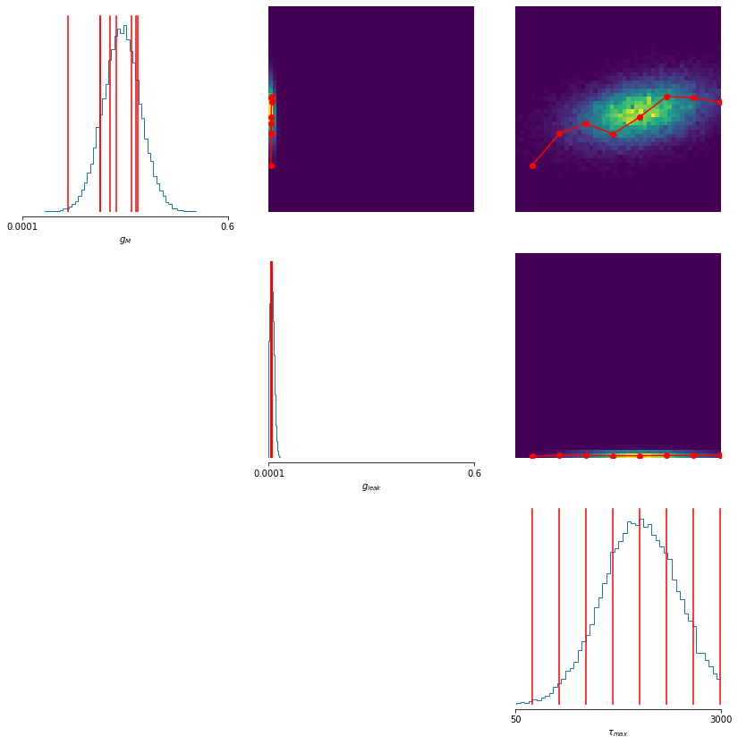
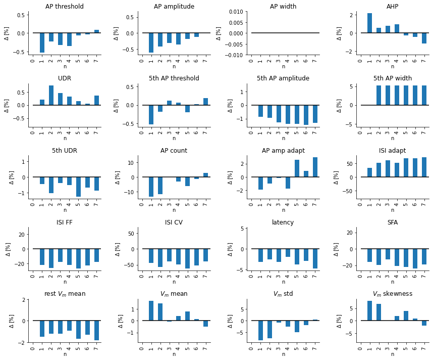
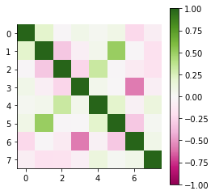
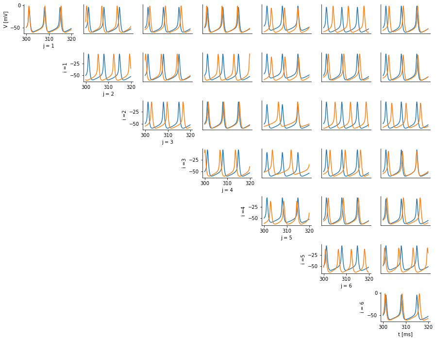

### Revealing compensation mechanisms in Hodkin-Huxley type models with simulation based inference
In this repository I will try to document the progress I make trying to find compensatory mechanisms in Hodgkin-Huxley-like neurons. This is the second lab rotation project of my master's degree. I will add resources, references, findings and code as I go.

#### Code-Structure:
Analytic work is done withing the jupyter-notebooks in the /code directory. However, the bulk of the code is contained within _EphysSBIHelper_ for convenience reasons. The module contains classes and functions helpful for identifying compensation mechanisms in Hodgkin-Huxley type neurons with simulation based inference (SBI). The goal of this code-base is to provide complementary functionality around the sbi library by [@mackelab/sbi](https://github.com/mackelab/sbi) for a more efficient workflow in identifying compensation mechanisms from electrophysiological recordings of single HH-type neurons. The Module is split up into submodules that each deal with one aspect of this problem setting.

- _datautils_ contains classes and functions to import, inspect and prepare the raw data.
- _simutils_ contains implementations of simulators in Brian2, C++ and python and also contains functions for efficient and fast parallel computation of the HH equations.
- _plotutils_ offers a diverse range plots useful for the analysis of the data.
- _evalutils_ provides additional analysis tools of the sbi posterior objects, like the addition of Mixture Density Network (MDN) specific posterior classes, that enable more a more flexible  evaluation and conditioning of posterior objects than provided by sbi.
- _ephys\_extractor_ and _ephys\_features_ are tools provided by the Allen Institute for electrophysiological feature extraction.

Parts of the code-base have been adapted from prior work by [@ybernaerts](https://github.com/ybernaerts).

### Features:
#### Import electrophysiological recordings.
- Electrophysiological recordings can be imported from .mat files or dictionaries of the form {"Trace_X_X_X_X": \[V(t)\], "Trace_X_X_X_Y": \[V(t)\], ...} with relatively few lines of code.
- _Data_ stores all relevant information and makes retrieval and changes at any time possible.

```python
# specify data parameters
cell_params = {"Description": "TestCell", "C": 1e-2, "Type": "some_cell_type"}
exp_params = {"StimDur": 0.6, "StimOnset": 0.1, 
              "StimEnd": 0.7, "ObsTime" :1., 
              "IStep": 20*1e-12, "LiqJuncPotential": 15.4*1e-3,
              "Description": "data_file_xyz.mat"}

# set file location
observations = './data_file.mat'


ExpData = Data(observations, exp_params=exp_params, cell_params=cell_params)

```

- (Automatically) select and trim voltage traces.

```python
ExpData.select_subset([electrode_idx], t_cutoff=0.8)
```

- Fit cellular parameters like A<sub>soma</sub> R<sub>in</sub> and tau.
- Add current stimulation protocol and attach it to data points automatically.
- Pick a suitable trace.

```python
# Either fit and/or set $R_{in}$ and $\tau$ manually
ExpData.fitcell2observations(show=False)
ExpData.set_syn_current(R_in,tau)

trace = ExpData.Observations_selected[index]
```

- A large part of the data import is to make the inspection of the data set or single voltage traces as straight forward as possible. `.inspect()` can be used for both single voltage traces and the whole dataset to take a peak at the underlying object at any time.

```python
ExpData.inspect()
trace.inspect()
```

.png)

- A range of summary statistics can be calculated in one line.

```python
trace.summarise()
```

- Simulation of neurons with a given stimulus can be done via `runHH()`.
	- Simulators are implemented in Brian2, C++ and python.
	- Functionality to parallelise and run in batches can be found in _simutils_.
	
Example of simulating a large quantity of parameters, with the same stimulation protocol as in the observation:

```python
theta = prior.sample((100000,)) # using a prior from sbi.utils

summaries = simulate_and_summarise_batches(theta, 
syn_current=trace.get_syn_current(),
num_workers=2, 
batch_size=100
)
```

- MDN posteriors learned with [@mackelab/sbi](https://github.com/mackelab/sbi) can be analysed and conditioned using `MDNPosterior` and `ConditionalMDNPosterior`.
	`MDNPosterior` extracts the mixture components from the posterior object and inherits all functionalities from sbi's DirectPosterior while providing more flexible conditioning methods that make use of the Gaussian nature of MDNs. .log_prob() and .sample() are also changed to work with conditioned Gaussian Mixture Models (GMMs).

Example:
```python
mdn_posterior = MDNPosterior(posterior)

condition = (NaN,NaN,0,0,0,NaN) # conditiones on all  x != NaN
cond_mdn_posterior = mdn_posterior.conditionalise(condition)

X = cond_mdn_posterior.sample((1,))
cond_mdn_posterior.log_prob(X)

```

- Functionality to fit paths between points on the posterior, that remain in regions of high posterior density as much as possible.



- ...and functionality to visualise changes in voltage traces and summary statistics along this path.



- Various plotting functions for a range of interesting scenarios pre and post training of the posterior.
	- i.e. Checking if which summary statistics of a set of simulated traces covers the observed summary statistics,
	- Comparing simulated and observed traces and features,
	- Analysing (conditional) correlations between parameters.
	
	
	
	
	...visualise parameter changes along the correlation axis ...
	
	
	
... and more

### To Does:
#### Next Up:
- ~~Add plotting for conditional distributions.~~
- ~~Adapt Simulator input for ammortisation over A and V_0.~~
	- ~~add 2 modes or auto detection?~~
	- ~~check for consistency across the functions~~
- ~~run HH Simulations along paths of high posterior probability.~~
	- ~~Select points.~~
	- ~~Search for high posterior path, by minimising path integral.~~
	- ~~Needs log_prob method for conditional posterior to work~~

- ~~Implement MDN conditional posterior log_prob functionality and method to show arbitrary conditions.~~
	- ~~ability to evaluate several Xs at once~~

#### Nice-To-Haves:
- ~~Specify summary function~~
- ~~Split EphysSBIHelper into different files -> better module structure~~
	- ~~EphysPlotHelper~~
	- ~~EphysEvalHelper~~
	- ~~EphysDataHelper~~
	- ~~EphysSimHelper~~
- Add temperature selection to HH.
- Add functionalitity to import 25°C data from https://gui.dandiarchive.org/#/dandiset/000008/draft.
- Automatic electrode selection. 
~~- Implement HH model in Brian2.~~
	- Implement standalone code generation
- ~~only run .summary() if selected stats change or self.Summary() == None.~~
- Speed up best_matches / .summary() routine -> possibly implemnt in C.
- ~~Sampling functionality for conditional distributions.~~
- ~~Possibility to save and load trained posterior objects.~~

#### Continually:
- Keep Module up to date with code from dev_notebook
- Add Docstrings to functions and methods.
- Add Comments.
- Format Code.
- Include functionality to save figures and data throughout.

### Known Issues:
- Code contains many uneccesary type converions and reshape operations.
- ~~C++ Implementation of HH suffers from memory leak~~
- ~~MDN extraction is faulty~~
- The use of units is inconsistent. Outputs all valid however.
- .summary() is a bit slow -> best_matches is very slow.
- ~~.summary() gets run every time it is called regardless of self.Summary != None.~~
- Running summarise\_batches only works with num\_workers = 1 unless imported from Module, i.e. EphysSBIHelper.
- ~~conditional_corrcoeff output somehow not normalised. [Open issue #1](https://github.com/mackelab/sbi/issues/403), 
[Open issue #2](https://github.com/mackelab/sbi/issues/404)~~
